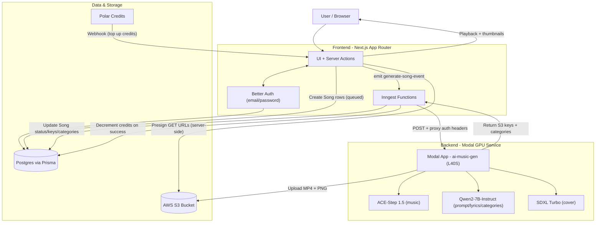

# 🎵 AI Music Generator — Event‑Driven, GPU‑Backed Generation

A production-style, full-stack AI music generation platform. Users submit a description or lyrics, and the system produces:

- 🎧 An audio track (`.mp4` with AAC audio)
- 🖼️ A cover image (`.png`)
- 🏷️ Categories (LLM-generated tags)

Heavy inference runs on Modal GPUs, while the web app stays responsive via Inngest background jobs and a credit-based gating system.

## 🏗️ High-level system architecture

## 🔄 End-to-end generation flow (click “Generate”)

1. **Create job(s) in Postgres** — A server action (`frontend/src/actions/generation.ts`) creates **two** `Song` rows for the same request (currently `infer_step=8` and `infer_step=12`) and emits `generate-song-event` to Inngest.
2. **Credit gate** — The Inngest function (`frontend/src/inngest/functions.ts`) loads the song + user credits. If `credits <= 0`, it marks the song `status="no credits"` and stops.
3. **Async GPU call** — If credits are available, Inngest sets `status="processing"` and calls the Modal endpoint (chosen from `GENERATE_FROM_DESCRIPTION`, `GENERATE_WITH_LYRICS`, `GENERATE_FROM_DESCRIBED_LYRICS`) using `Modal-Key` / `Modal-Secret` headers.
4. **Generate + upload** — The Modal backend (`backend/main.py`) uses:
   - **Qwen2** to reformat prompts and (when needed) generate lyrics
   - **ACE-Step** to generate a WAV, then **FFmpeg** to convert it to MP4/AAC (`+faststart`)
   - **SDXL Turbo** to generate a cover image
   - **boto3** to upload audio + image to S3
   It returns `{ s3_key, cover_image_s3_key, categories }`.
5. **Persist results + charge** — Inngest updates the `Song` row with S3 keys, connects/creates categories, and **decrements credits by 1** only when the Modal response is successful.
6. **Playback** — The frontend generates **S3 presigned GET URLs** server-side (see `getPlayUrl` in `frontend/src/actions/generation.ts`) and streams the audio in the dashboard.

## 📂 Repo structure (no-code-reading guide)

| Path | What it is | Inputs → Outputs |
| --- | --- | --- |
| `backend/` | Modal-deployed GPU service that runs the AI pipeline and uploads outputs to S3. | JSON request → S3 object keys + categories |
| `backend/main.py` | Modal app + image definition, model loading, FFmpeg conversion, S3 upload, and the three production endpoints used by the frontend. | `Generate*Request` → `GenerateMusicResponseS3` |
| `backend/prompts.py` | Qwen2 instruction templates for turning descriptions into ACE-Step tags and generating lyrics in the requested ISO 639-1 language/script. | (description, language) → tags / lyrics |
| `frontend/` | Next.js app that handles auth, credits, DB state, job orchestration, and playback. | User actions → DB rows → media playback |
| `frontend/src/actions/` | Server Actions for creating songs, emitting Inngest events, and presigning S3 playback URLs. | Form input → DB writes / presigned URLs |
| `frontend/src/inngest/` | Inngest client + functions. The worker calls Modal, updates DB, and deducts credits. | Event → Modal call → DB updates |
| `frontend/prisma/schema.prisma` | Postgres schema for users, songs, likes, categories, and Better Auth tables. | Prisma models → DB tables |
| `frontend/src/lib/auth.ts` | Better Auth + Polar integration (Polar sandbox) including webhook-driven credit top-ups. | Sign-in / webhook → session / credits |

## 🔐 Security model (practical)

- **Modal proxy auth:** All Modal endpoints are `requires_proxy_auth=True`; callers must send `Modal-Key` and `Modal-Secret`. Keep these values server-side only.
- **S3 access:** AWS credentials are used server-side to upload (backend) and to presign playback URLs (frontend). The browser only ever receives time-limited presigned URLs.
- **Credits:** Credits are decremented only on successful generation, and Polar webhooks can increment credits on purchase.

## 🚀 Quick start (local frontend + deployed backend)

- Backend: see `backend/README.md` (`modal serve` / `modal deploy`, Modal Secret, volumes)
- Frontend: see `frontend/README.md` (env vars, DB, `npm run dev`, `npm run inngest`)
